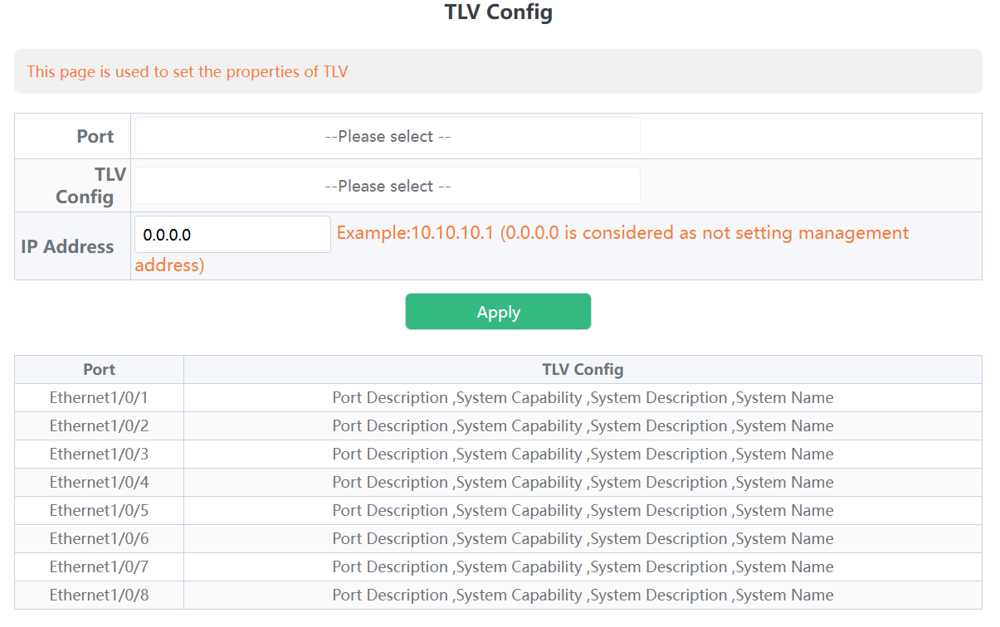

# LLDP

LLDP（Link Layer Discovery Protocol）は自分の機器情報をマルチキャストするL2プロトコル。Ciscoは独自プロトコルでCDPを持っている。

> 　LLDPは、隣接機器の検出に際してTLVと呼ばれるタイプ（Type）長さ（Length）値（Value）の属性を
> 　を使用してネイバーから情報を認識することができます。LLDPで送信する「必須のTLV」は次の3つです。
>
> 　・　Chassis ID
> 　・　Port ID
> 　・　Time To Live
>
> https://www.infraexpert.com/study/catalyst25.html

## Ubuntu

> lldpadは扱いずらいからlldpdを利用する。パッケージ名サービス名ともに`lldpad`

```bash
sudo apt remove lldpad
sudo apt install lldpd
sudo systemctl enable lldpd --now
```

自分のアドバタイズ内容を確認

```bash
sudo lldpcli show chassis
sudo lldpcli show interfaces
```

LLDPの設定内容を確認（アドバタイズ間隔など）

```bash
sudo lldpcli show configuration
```

ネイバーの確認

```bash
sudo lldpcli show neighbors
-------------------------------------------------------------------------------
LLDP neighbors:
-------------------------------------------------------------------------------
Interface:    enp3s0, via: LLDP, RID: 1, Time: 0 day, 00:05:49
  Chassis:
    ChassisID:    mac 84:e5:d8:
    SysName:      Switch
    SysDescr:     Switch
    Capability:   Bridge, on
    Capability:   Router, on
  Port:
    PortID:       local 3
    PortDescr:    Ethernet1/0/3
    TTL:          120
-------------------------------------------------------------------------------
```

## Ubuntu(lldpad)

インターフェイスの設定（送受信）

```bash
sudo lldptool set-lldp -i enp3s0 adminStatus=rxtx
```

> デフォルトではLLDPが有効な機器がつながっている程度しか広告されない。MACアドレスはわかる。

必要に応じでTLVを追加する

```bash
i=enp3s0
sudo lldptool -T -i $i -V  mngAddr enableTx=yes
# 明示的に指定する場合
sudo lldptool -T -i $i -V mngAddr ipv4=192.168.144.33
```

## SW

基本すべての情報を0.0.0.0/0で投げる。

