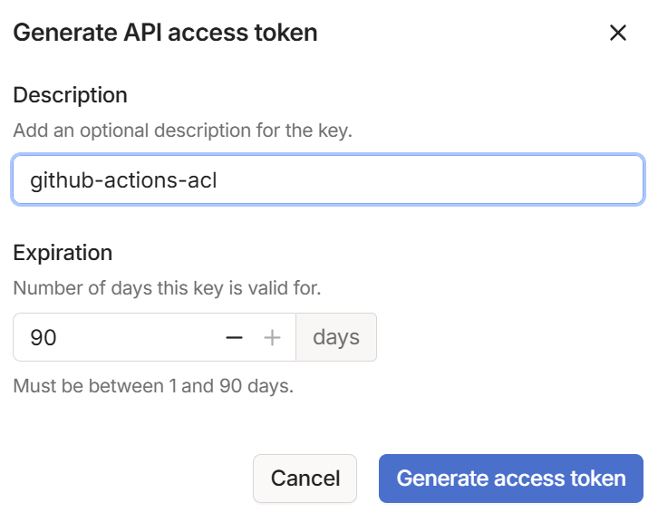
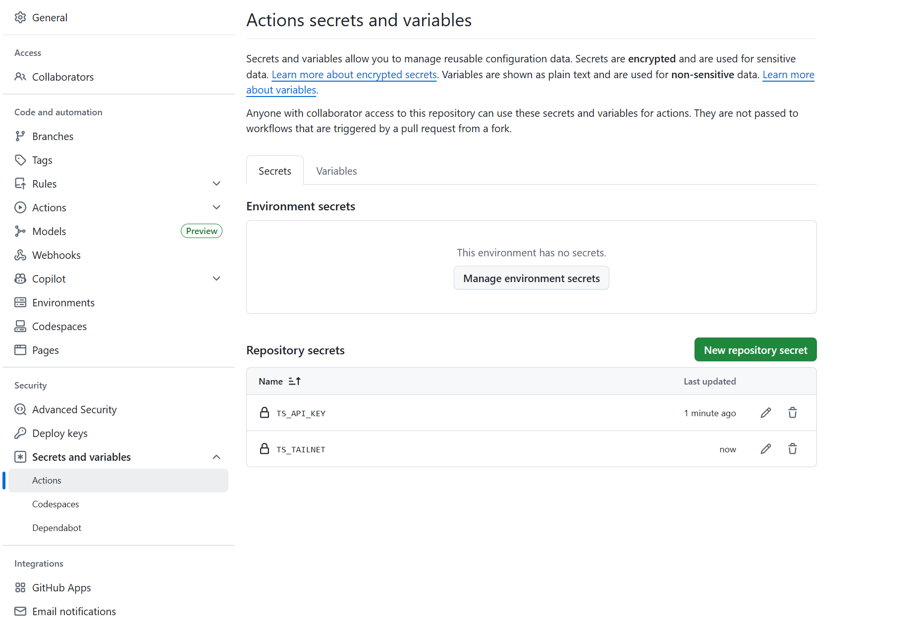

# tailscale

## ACL GitHub Actions

https://tailscale.com/kb/1306/gitops-acls-github

アクセストークンの発行: github-actions-acl



アクセストークンをgithubのリポジトリシークレットに保存

- TS_API_KEY: 上述
- TS_TAILNET: 例: `example.com`、`myemail@example.com`、`example.github`



`.github/workflows/tailscale.yml`

```yaml
name: Sync Tailscale ACLs

on:
  push:
    branches: [ "main" ]
  pull_request:
    branches: [ "main" ]

jobs:
  acls:
    runs-on: ubuntu-latest

    steps:
      - uses: actions/checkout@v3

      - name: Deploy ACL
        if: github.event_name == 'push'
        id: deploy-acl
        uses: tailscale/gitops-acl-action@v1
        with:
          api-key: ${{ secrets.TS_API_KEY }}
          tailnet: ${{ secrets.TS_TAILNET }}
          action: apply
          policy-file: ./tailscale/policy.jsonc

      - name: Test ACL
        if: github.event_name == 'pull_request'
        id: test-acl
        uses: tailscale/gitops-acl-action@v1
        with:
          api-key: ${{ secrets.TS_API_KEY }}
          tailnet: ${{ secrets.TS_TAILNET }}
          action: test
          policy-file: ./tailscale/policy.jsonc

```

`.tailscale/policy.jsonc ` 例

```jsonc
{
	"tagOwners": {
		"tag:trust":     ["autogroup:admin"],
		"tag:dmz":       ["autogroup:admin"],
		"tag:none":      ["autogroup:admin"],
		"tag:monitored": ["autogroup:admin"]
	},
	"acls": [
		// trustタグからの通信をすべて許可
		{"action": "accept", "src": ["tag:trust"], "dst": ["*:*"]},
		// dmzタグへの通信をすべて許可
		{"action": "accept", "src": ["*"], "dst": ["tag:dmz:*"]},
		// ログ送信を許可
		{
			"action": "accept",
			"src": ["*"],
			"dst": ["logserver:5080"]
		}
	]
}
```
