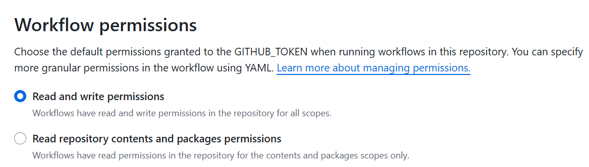

## セットアップ

リポジトリを初期化する

```
mkdir docs
git init
cd docs
```

WSL Ubuntuでパッケージを入れる

```
sudo apt install mkdocs
```

mkdocs初期化

```
mkdocs new temp
```

中身を出す

```
mv temp/* ./
rmdir temp
```

コミットして、GithubにパブリックでPush

## ビルド/デプロイ

以下のコマンドで一括実施

```
mkdocs gh-deploy
```

- mdをビルドして./siteに保存
- ./siteをルートにgh-pagesブランチにコミット

.gitignore作成

```
/site/
```

## Actions

書き込み権限を与える



https://squidfunk.github.io/mkdocs-material/publishing-your-site/

`.github/workflows/mkdocs-build-deploy.yaml`

```yaml
name: mkdocs-build-deploy
on:
  push:
    branches:
      - master 
      - main
permissions:
  contents: write
jobs:
  deploy:
    runs-on: ubuntu-latest
    steps:
      - uses: actions/checkout@v4
      - name: Configure Git Credentials
        run: |
          git config user.name github-actions[bot]
          git config user.email 41898282+github-actions[bot]@users.noreply.github.com
      - uses: actions/setup-python@v5
        with:
          python-version: 3.x
      - run: echo "cache_id=$(date --utc '+%V')" >> $GITHUB_ENV 
      - uses: actions/cache@v4
        with:
          key: mkdocs-material-${{ env.cache_id }}
          path: .cache 
          restore-keys: |
            mkdocs-material-
      - run: pip install mkdocs-material 
      - run: mkdocs gh-deploy --force
```